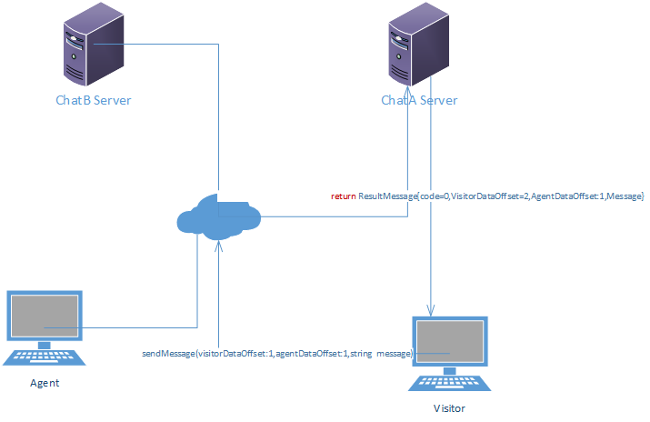

# chat server 数据重建

## 现有状况

...
## 设计目标

chatserver服务器发生切换的时候，通过agent和visitor的本地数据对chatserver切换的服务器进行聊天数据的重建，确保聊天连续性和数据完整性

## 总体思路
 
Visitor或者agent 向chatserver 发送信息的时候，将在http头信息中传入两个数据偏移量参数visitorDataOffset和agentDataOffset（这两个参数分别记录了visitor或者agent 本地记录的聊天信息的数据版本号，该版本号可以标识本地消息的新旧程度） 发送到chatserver：
chatserver 通过比较这两个dataOffset 的大小可以判断chatserver 上面的visitor和anget 的聊天记录是不是比（visitor或者agent）本地存放的聊天记录新，如果chatserver 聊天记录比（visitor或者agent） 端的聊天记录新的话，chat server 接收到新的信息以后将根据情况递增chatserver本地的chat 对象的visitorDataOffset或者agentDataOffset的值并且将最新的未读聊天信息和更新后的dataoffset返回给visitor或者agent,visitor或者agent获取返回值以后，对本地聊天记录进行更新，并且更新本地的visitordataOffset和agentDataOffset。 如果chatserver的聊天记录比较老的话，将返回结果通知visitor或者agent，进行数据重建。


##  场景

###  正常场景

  

  Visitor 或者Agent 通过服务器chatA server 聊天，visitor 通过心跳接口或者发送信息接口 将本地的数据偏移量visitorDataOffset和agentDataOffset 和聊天信息传到chatserver ，chatserver 接收到新的信息以后
  将更新以后的visitorDataOffsethu和agentDataOffset和最新的聊天信息返回给visitor或者agent,visitor或者agent获取返回值以后，对本地记录进行更新（更新本地的visitorDataOffset和agentDataOffset还有本地的聊天记录）。
 

###  切换后场景


 

   chatA server 服务器down掉以后，服务器切换到chatB server,visitor或者agent再给chatserver发送信息，这个时候，消息将发送到chatB server :
   1. chatb server 判断是否存在该聊天，如果不存在,就根据chatid 创建一个chat,然后返回ReturnResult{code=1,VisitorDataOffset=-1,AgentDataOffset=-1} 给visitor或者agent端，通知其进行全量数据重建，visitorDataOffset=-1表示visitor的聊天记录全部重新重建，agentDataOffset同理。
  2. 如果聊天存在的话，比较chat.visitorDataOffset和chat.agentDataOffset跟参数visitorDataset,agentDataset的大小，如果chat.visitorDataOffset小于visitorDataOffset,或者chat.agentDataOffset小于agentDataOffset 时,chatserver 将返回ReturnResult{code=1,visiorDataOffset=chat.visitorDataOffset,agentDataOffset=chat.agentDataOffset}，通知visitor或者agent 进行数据增量重建。
   
   


 ```c#
   ReturnReuslt SendMessage(int chatId,int visitorDataOffset,int agentDataOffset,string message)
   {
    
         if(!exists(chatId)) 
         {

           create chat(chatId);
           return new ReturnResult{code=1,visitorDataOffset=-1,agentDataOffset=-1};
         }
       
        if(visitorDataOffset>chat.visitorDataOffset||agentDataOffset>chat.agentDataOffset)
        return new ReturnResult{code=1,visitorDataOffset=chat.visitorDataOffset,agentDataOffset=chat.agentDataOffset};

        ...
   }

   bool Rebuild(Chat chat)
   {
       int rebuildCount=0;
       while(!chat.Rebuild(chat))
       {
           if(rebuildCount>5)
           break;
           Thread.sleep(500);
           rebuildCount++;
       }
       
   }
```
 


## ChatServer 内部数据结构 

   
### Message
1.  访客信息
   ```c#
  public class Visitor
  {
    public object Id{get;set;}
    public string Name{get;set;}
    public string Email{get;set;}
    ...

  }
  ```
2.  坐席信息
   ```c#
  public class Agent
  {
    public object Id{get;set;}
    public string Name{get;set;}

  }
  ```
  3.  消息类型
   ```c#
  public enum MessageType
  {
     Visitor=1,--访客
     Agent=2,--坐席
     Bot=3,--bot
  }
  ```

4.  聊天记录
   ```c#
   public class Message {
    public long Id{get;set;}
    public string Content{get;set;}
    public DateTime  SendTime{get;set;}
    public DateTime DataOffset{get;set;}
    public MessageType MessageType{get;set;}
    ...
   }
 
  ```
5.  聊天
   ```c#
   public class Chat {
    
    private List<Message> VisitorMessages{get;set;}
    private List<Message> AgentMessages{get;set;}

    public object Id{get;set;}
    public Visitor Visitor{get;set;}
    public int VisitorOffset{get;set;}
    public int AgentOffset{get;set;}
    public DateTime BeginTime{get;set;}
    public bool IsReBuilding{get;set;}

    ...
    public int AddVisitorMessage(Message message)
    {
        VisitorOffset+=1;
        VisitorMessages.Add(message);
        ...
        return VisitorOffset;
    }
    public int AddAgentMessage(int agentId,Message message)
    {
        AgentOffset+=1;
        AgentMessages.Add(message);
        ...
        return AgentOffset;
    }
    public  SortedList<int,Message> GetAllMessage()
    {
         List<Message> totalMessages=new  List<Message>();
         totalMessages.Add(VisitorMessages);
         totalMessages.Add(AgentMessages);
         return totalMessages.Sort(r=>r.SendTime);
    }
    public List<Message> GetNewMessage(int visitorOffset,agentOffset)
    {
           List<Message> newMessages=new  List<Message>();
           newMessages.AddRange( VisitorMessages.Where(r => r.DataOffset > visitorOffset));
           newMessages.AddRange( AgentMessages.Where(r => r.DataOffset > AgentOffset));
          return newMessages.Sort(rr=>r.SendTime);
    }

    public bool Rebuild(Chat chat)
    {
       if(IsReBuilding) return false;
       lock(IsReBuilding)
       {
           IsReBuilding=true;
           ....
           IsReBuilding=fasle;
       }
        
    }


   }
   ```
   Visitor和agent的offset 分开记录分别为visitorOffset和agentOffset,visitor的偏移量visitorOffset从0开始递增，每次递增1; agent的偏移量agentOffset从0开始递增，每次递增1.


##  Chatserver API Data Struct

  ### ReturnResult

  ```c#
     publc class ReturnResult
     {
          public int Code{get;set;} //0 success,-1 error ,1 data rebuild
          public int VisitorDataOffset{get;set;}
          public int AgentDataOffset{get;set;}
          public List<ChatMessage> Messages{get;set;}
          ...
     }

```
### ChatMessage
  ```c#
     publc class ChatMessage
     {
          public object Id{get;set;}
          public int DataOffset{get;set;}
          public string Content{get;set;}
          public int MessageType{get;set;}
          public DateTime SendTime{get;set;}
          ...
     }
```
### ReBuildChat
  ```c#
     publc class Chat
     {
          public object Id{get;set;}
          public int VisitorDataOffset{get;set;}
          public int AgentDataOffset{get;set;}
          public List<ChatMessage> Messages{get;set;}
          ...
     }
```


## Visitor & Agent 数据结构

   ```js
  Chat
  {
    var Id;
    var  VisitorDataOffset;
    Var  AgentDataOffset;
     var Messages = [
        { Id: 'xxx', Content: 'xxx',DataOffset:'xxx',MessageType='xxx', SendTime...}
        // ...
      ];
    ...
  }
 

 ```


 