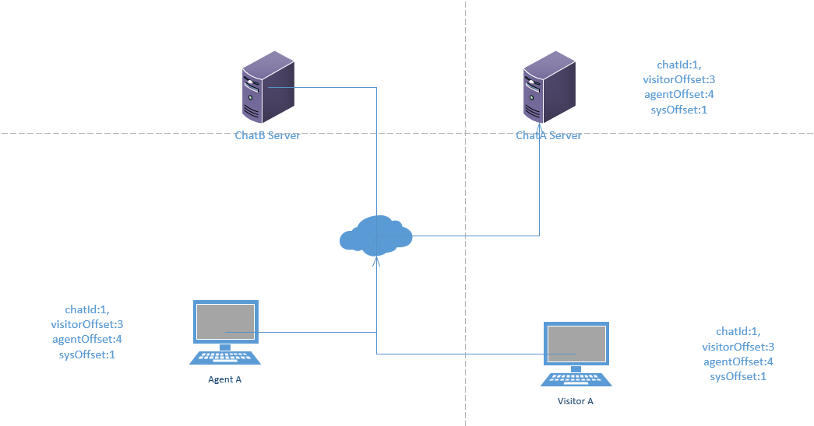
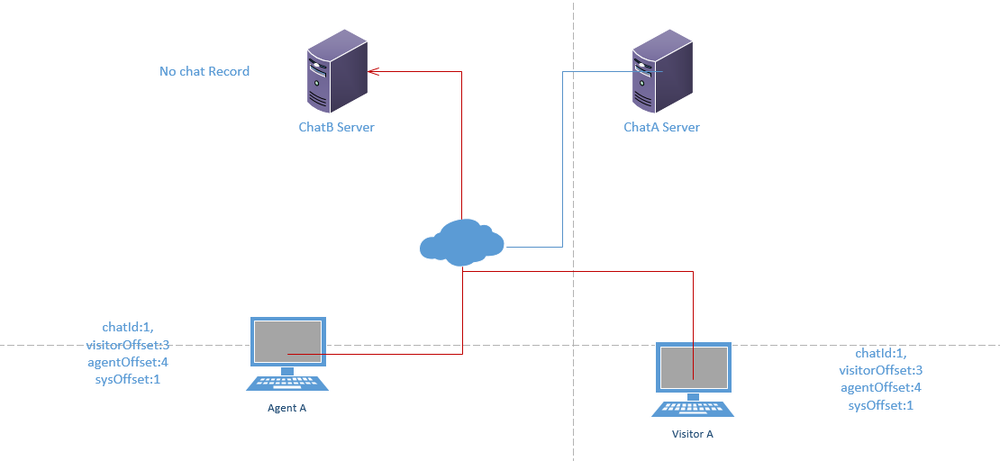
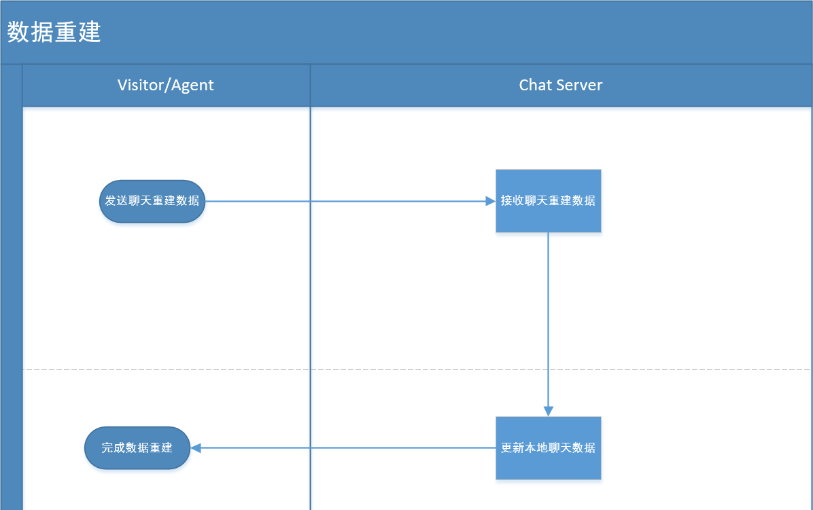

# chat server 数据重建

## 现有状况

...
## 设计目标
 1. visitor和agent 完成向chatserver发送聊天消息。
 2. visitor和agent 完成从chatserver的接收消息。
 3. chatserver服务器发生切换，完成聊天重建。

## 总体思路
 
 1. visitor或者agent 的聊天，在本地将会存放visitorOffset和agentOffset 分别用于标识visitor和agent 的聊天消息版本。
 2. 向chatserver 发送或者获取新消息的时候，将visitorOffset和agentOffset做为参数发送到chatserver.
 3. chat server 接收到信息以后，将会拿参数 visitorOffset和agentOffset 比较 chat server 本地chat 中的
 visitorOffset和agentOffset，如果本地的offset任意一个 小于 visitor或者agent的 visitorOffset和agentOffset，将会通知visitor或者agent 调用聊天重建接口进行数据同步。
 4. 数据同步期间，发送和获取记录操作，发送和获取操作将等待重建完成后再进行。

##  场景

###  服务器未发生切换

  

  agent A 和visitor A 的聊天存放在chatA server,agent和visitor的聊天记录跟chatA server 聊天记录一致，这时数据不需要重建.


###  服务器切换

  
  chatA server down掉以后，agentA 和visitorA 都连接到 ChatB Server 上，但是chatB server 并没有agent A和 visitor A 的聊天，这个时候就需要进行聊天重建。


##  发送聊天信息

  

 ```c#
   AddMessageResult AddVisitorMessage(int chatId,int visitorOffset,int agentOffset,string message)
   {
    
         if(!exists(chatId)) 
         {

           create chat(chatId);
           return new ReturnResult{code=1,visitorOffset=-1,agentOffset=-1};
         }
        
        if(visitorOffset>chat.visitorOffset||agentOffset>chat.agentOffset)
        return new ReturnResult{code=1,visitorOffset=chat.visitorOffset};
      
       Message message=new Message(){id=xxxx,context=message,sendTime=xxxx};
       chat.AddVisitorMessage(message);
       return new ReturnResult{code=1,visitorOffset=chat.visitorOffset,Message=message};

   }

   AddMessageResult AddAgentMessage(int chatId,int agentId,int visitorOffset,int agentOffset,string message)
   {
    
         if(!exists(chatId)) 
         {

           create chat(chatId);
           return new ReturnResult{code=1,visitorDataOffset=-1,agentDataOffset=-1};
         }
        

        if(visitorOffset>chat.visitorOffset||agentOffset>chat.agentOffset)
        return new ReturnResult{code=1,agentDataOffset=chat.agentDataOffset};
      
       Message message=new Message(){id=xxxx,context=message,sendTime=xxxx};

       chat.AddAgentMessage(agentId,message);
       return new ReturnResult{code=1,agentOffset=chat.agentOffset,Message=message};

   }


  
```
 


## 接收聊天信息

  


 ```c#
   GetMessageResult GetNewMessage(int chatId,int visitorOffset,int agentOffset,string message)
   {
    
         if(!exists(chatId)) 
         {

           create chat(chatId);
           return new ReturnResult{code=1,visitorDataOffset=-1,agentDataOffset=-1};
         }
       
        if(visitorOffset>chat.visitorOffset||agentOffset>chat.agentOffset)
        return new ReturnResult{code=1,visitorOffset=chat.visitorOffset,agentOffset=chat.agentOffset};
        
        ....
   }

 
```


## 聊天重建

   chatserver 返回请求聊天重建结果以后，visitor或者agent 将本地存放的chat 数据发送到chatserver,chat server 根据情况更新服务器内chat 数据。

  


 ```c#
   bool Rebuild(Chat chat)
   {
       chat.Rebuild(chat);
       ....
   }

 
```


## ChatServer 内部数据结构 

   
### Message
1.  访客信息
   ```c#
  public class Visitor
  {
    public object Id{get;set;}
    public string Name{get;set;}
    public string Email{get;set;}
    ...

  }
  ```
2.  坐席信息
   ```c#
  public class Agent
  {
    public object Id{get;set;}
    public string Name{get;set;}

  }
  ```
  3.  消息类型
   ```c#
  public enum MessageType
  {
     Visitor=1,--访客
     Agent=2,--坐席
     Bot=3,--bot
  }
  ```

4.  聊天消息
   ```c#
   public class Message {
    public object Id{get;set;}
    public string Content{get;set;}
    public DateTime  SendTime{get;set;}
    public DateTime DataOffset{get;set;}
    public MessageType MessageType{get;set;}
    ...
   }
 
  ```
5.  聊天
   ```c#
   public class Chat {
    
    private List<Message> VisitorMessages{get;set;}
    private List<Message> AgentMessages{get;set;}

    public object Id{get;set;}
    public Visitor Visitor{get;set;}
    public int VisitorOffset{get;set;}
    public int AgentOffset{get;set;}
    public DateTime BeginTime{get;set;}

    private object IsReBuilding{get;set;}
    private object IsAddMessage{get;set;}

    ...
    public Message AddVisitorMessage(Message message)
    {
       lock(IsReBuilding)
       {

        VisitorOffset+=1;
        message.DataOffset=AgentOffset;
        VisitorMessages.Add(message);
        ...
         return message;
       }
    }
    public Message AddAgentMessage(int agentId,Message message)
    {
      lock(IsReBuilding)
       {
        lock(IsAddMessage)
        {
            AgentOffset+=1;
            message.DataOffset=AgentOffset;
            AgentMessages.Add(message);
            ...
           
           return message;
        }
       }
    }
    public  SortedList<int,Message> GetAllMessage()
    {
         List<Message> totalMessages=new  List<Message>();
         totalMessages.Add(VisitorMessages);
         totalMessages.Add(AgentMessages);
         return totalMessages.Sort(r=>r.SendTime);
    }
    public List<Message> GetNewMessage(int visitorOffset,agentOffset)
    {
      lock(IsReBuilding)
       {
           List<Message> newMessages=new  List<Message>();
           newMessages.AddRange( VisitorMessages.Where(r => r.DataOffset > visitorOffset));
           newMessages.AddRange( AgentMessages.Where(r => r.DataOffset > AgentOffset));
          return newMessages.Sort(rr=>r.SendTime);
       }
    }

    public bool Rebuild(Chat chat)
    {
      
       lock(IsReBuilding)
       {
            //1.求chat.VisitorMessages 和 this.VisitorMessages的差集（根据ID判断）
            //2.将该差集循环加入this.VisitorMessages 中.
            //3.this.VisitorMessages 按DataOffset 排序，然后重新赋值给this.VisitorMessages 
       }
        
    }


   }
   ```
   Visitor和agent的offset 分开记录分别为visitorOffset和agentOffset,visitor的偏移量visitorOffset从0开始递增，每次递增1; agent的偏移量agentOffset从0开始递增，每次递增1.


##  Chatserver API Data Struct

  ### add message Result

  ```c#
     publc class AddMessageResult
     {
          public int Code{get;set;} //0 success,-1 error ,1 data rebuild
          public int VisitorOffset{get;set;} //visitor 发送消息的有该属性，值为当前visitorOffset
          public int AgentOffset{get;set;}   //agent 发送信息的时候有 该属性,值为当前agentOffset
          public ChatMessage Message{get;set;}
          ...
     }

```


  ### get message Result

  ```c#
     publc class GetMessageResult
     {
          public int Code{get;set;} //0 success,-1 error ,1 data rebuild
          public int VisitorDataOffset{get;set;}
          public int AgentDataOffset{get;set;}
          public List<ChatMessage> Messages{get;set;}
          ...
     }

```


 


### ChatMessage
  ```c#
     publc class ChatMessage
     {
          public object Id{get;set;}
          public int DataOffset{get;set;}
          public string Content{get;set;}
          public int MessageType{get;set;}
          public DateTime SendTime{get;set;}
          ...
     }
```
### ReBuildChat
  ```c#
     publc class Chat
     {
          public object Id{get;set;}
          public int VisitorDataOffset{get;set;}
          public int AgentDataOffset{get;set;}
          public List<ChatMessage> Messages{get;set;}
          ...
     }
```


## Visitor & Agent 数据结构

   ```js
  Chat
  {
    var Id;
    var  VisitorDataOffset;
    Var  AgentDataOffset;
     var Messages = [
        { Id: 'xxx', Content: 'xxx',DataOffset:'xxx',MessageType='xxx', SendTime...}
        // ...
      ];
    ...
  }
 

 ```


 