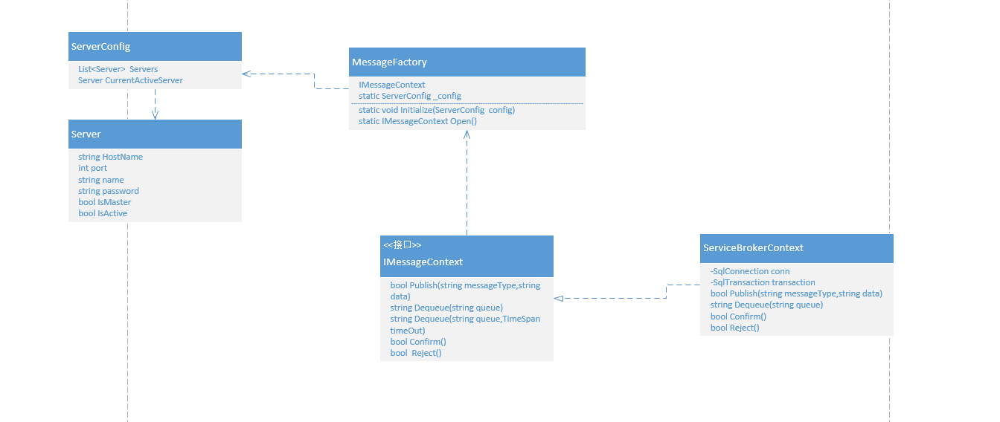

· 

# chat server 异步消息处理

## 现有状况

...
## 设计目标
 1. 异步处理chat server 一些耗时的消息处理流程，解耦chat server 和一些功能的依赖。
 2. 通过异步处理提升chat server 的性能。

## 总体思路
  
  Chat Server 一些同步的消息处理，将采用 service broker 进行异步解耦, consumer service 及时的消费service broker 中数据，完成后续处理流程。
  1. 消息处理流程：chat server 推送事件，将事件消息写入 service broker message queue Server 中的主消息队列中， 存储过程负责将这些等待处理的事件信息写入到订阅了这些事件信息的子 data queue 中（订阅关系配置在第2点中），以供具体的消费者consumer去消费这些数据。
  2. service broker 主message  queue 和子data queue 的关系配置在表 [t_queue_message_type](#t_queue_message_type)和 [t_data_queue](#t_data_queue)中。
  3. Remote  Service Broker Message type Queue Server 为远程事件队列服务器，Main Service Broker Message Queue Server down掉以后事件将会发送到上面，同时也作为副服务器的事件队列服务器。
  4. Remote  Service Broker message Queue Server 上的事件数据， 会通过service broker的配置将数据同步到主服务器上的data queue中。
  5. 最终consumer service 将会从data queue 中 拿出这些数据，消费掉，完成最后的流程处理。
  6. Service Broker 将会部署到一个单独的数据中库，专门存放Service Broker的队列信息。
  7. consumer service 将会部署到单独的web应用程序中。


## Message Type

  
 |Message Type |  Description |    
  | - | :-: |
  | [chat.queued](#chat.queued) |  chat 排队统计|  5分钟更新一次的部门等待聊天的访客排队数日志 |
  | [chat.started](#chat.started) |  聊天开始 |   
  | [chat.ended](#chat.ended) | 聊天结束时需要记录的消息 |   
  | [chat.wrapup.submitted](#chat.wrapup.submitted) |wrapup 提交的信息 |   
  | [chat.rating.submitted](#chat.rating.submitted) | rating 提交的信息|   
  | [visitor.landed](#visitor.landed) |访客登入时提交的信息 |  
  | [visitor.conversion.achieved](#visitor.conversion.achieved) |发生有效客户转换的记录的信息 |   
  | [ban.added](#ban.added) | 添加黑名单资料|   
  | [offlinemessage.submitted](#offlineMessage.submitted) |离线留言消息 |   
  | [agent.status.changed](#agent.status.changed) | 坐席状态改变消息|   
  | [agent.preference.changed](#agent.preference.changed) | 坐席个性化设置变更信息|   
  | [agentchat.replied](#agentChat.replied) |坐席私聊回复信息 |   
  | [cannedmessage.used](#cannedmessage.used) | 快捷信息使用时记录的日志 |   
  | [autoinvitation.log](#autoinvitation.log) | 自动邀请时记录的消息日志 |   
  | [manualinvitation.log](#manualInvitation.log) | 手动邀请时记录的消息日志 |  


## Message Produce  And Consume
  

### Initialize 

应用程序启动时，初始化 MessageFactory 配置,MessageFactory 内部实现，将自动心跳检查配置的服务器状态，自动切换服务器。

```c# 


public void Initialize()
{
   ServerConfig serverConfig=new ServerConfig();
   serverConfig.Servers.Add(new Server(){Ip=xxx,port=xxx,name=Master,Password=xxx,IsMaster=true,IsActive=true});//添加Server broker主服务器
     serverConfig.Servers.Add(new Server(){Ip=xxx,port=xxx,name=Slave,Password=xxx,IsMaster=true,IsActive=true});//添加Server broker副服务器
   MessageFactory.Initialize(serverConfig);

}
 

```


### Produce

```c# 


public class MessageProducer
{
     
    public bool ChatEnd(Chat chat)
    {
      bool successed=false;
      using(IMessageContext context=  MessageFactory.Open())
      {
       string data=SerializeObject(chat);
       successed= context.Publish("chat.ended",data);
      }
      return  successed;
    }
   
   public bool OfflineMessage(OfflineMessage offlineMessage)
   {
      bool successed=false;
      using(IMessageContext context=  MessageFactory.Open())
      {
      string data=SerializeObject(offlineMessage);
      successed=  context.Publish("offlineMessage.submitted",data);
      }

   return successed;

   }
   ...
   ...
    string   SerializeObject(object data)
    {

       return    JsonConvert.SerializeObject(data);   
    }   

}


```
 


###  Consumer

  

 注意，Error 队列 ，存放 从消息队列中取出来的数据格式有问题的数据，或者调用接口 由于数据原因出错，处理失败的队列数据。不加入该队列的数据处理场景，例如：由于网络问题，导致发送邮件失败，或者调用webhook失败。
```c# 
  

 
 
 public void  Initialize()//消费者初始化，在程序启动的时候调用一次即可
 {
    
     int emailThreadHandleCount ,  maxEmailThreadCount;
     int.TryParse(ConfigurationManager.AppSettings["EmailThreadHandleCount"].ToString(),out emailThreadHandleCount);//邮件消费队列，每个线程处理数，实际消费线程数是该值的倍数。
      int.TryParse(ConfigurationManager.AppSettings["MaxEmailThreadCount"].ToString(),out maxEmailThreadCount);//邮件消费队列 最大线程处理数
     ServerConfig serverConfig;// 初始化并且配置ServerConfig
     ConsumerManager.Initialize(serverConfig);
     ConsumerManager.Run(new EmailConsumer(), emailThreadHandleCount,maxEmailThreadCount);
     ...//在此加入其它消费队列实现。
 }

    public class ConsumerManager
    {

        private static Dictionary<string, ConsumerWrap> consumers = new Dictionary<string, ConsumerWrap>();
        private static ServerConfig _serverConfig;
        public static void Initialize(ServerConfig serverConfig)
        {
            _serverConfig = serverConfig;
            MessageFactory.Initialize(_serverConfig);
        }

        public static void Run(IConsumer consumer,int everyThreadHandleCount)
        {
            if (!consumers.ContainsKey(consumer.QueueName))
                consumers.Add(consumer.QueueName, new ConsumerWrap(consumer, everyThreadHandleCount));
        }

    }


   public class ConsumerWrap
    {
        private ConcurrentBag<ConsumerThread> threads;
        private IConsumer consumer;
        private int everyThreadHandleCount;
        private int maxThreadCount = 0;
        private int queueDataCount = 0;
        private Thread queryCountThread = null;
        public ConsumerWrap(IConsumer consumer, int everyThreadHandleCount,int maxThreadCount)
        {
            this.consumer = consumer;
            this.everyThreadHandleCount = everyThreadHandleCount;
            this.maxThreadCount=maxThreadCount;
            this.threads = new ConcurrentBag<ConsumerThread>();
            this.UpdateConsumers(everyThreadHandleCount);
            this.queryCountThread = new Thread(QueryCount);
            this.queryCountThread.IsBackground = true;
            this.queryCountThread.Start();
        }

        private void UpdateConsumers(int queueDataCount)
        {
            int threadCount = (int)Math.Ceiling((Decimal)(queueDataCount / everyThreadHandleCount));

            int dif = threadCount - threads.Count;
            if (dif == 0) return;
            if (dif > 0)
            {
                for (int i = 0; i < dif; i++)
                {
                    ConsumerThread consumerThread = new ConsumerThread(consumer);
                    consumerThread.IsRunning = true;
                }
            }
            else
            {
                dif = System.Math.Abs(dif);
                for (int i = 0; i < dif; i++)
                {
                    ConsumerThread consumerThread = null;
                    if (threads.TryTake(out consumerThread))
                        consumerThread.IsRunning = false;
                }

            }
        }

        private void QueryCount()
        {
            while (true)
            {


                IMessageContext context = null;
                try
                {
                    context = MessageFactory.Open();
                    queueDataCount = context.GetCount(consumer.QueueName);
                    if (threads.Count <= maxThreadCount)
                     this.UpdateConsumers(queueDataCount);
                }
                catch (Exception ex)
                {

                }

                Thread.Sleep(1000);
            }
        }

    }


    public class ConsumerThread
    {

        public IConsumer Consumer { get; set; }
        private bool isRunning = false;
        private Thread thread;
        public bool IsRunning
        {
            get { return isRunning; }
            set
            {
                isRunning = value;
                if (isRunning)
                {
                    thread.Start();
                }
            }
        }

        public ConsumerThread(IConsumer consumer)
        {
            this.Consumer = consumer;

            thread = new Thread(excute);
            thread.IsBackground = true;

        }

        void excute()
        {
            while (isRunning)
            {
                Consumer.Consume();
                Thread.Sleep(50);
            }
            thread.Abort();
            thread = null;
        }

    }


public interface IConsumer
{
  string QueueName { get; }
  void Consume();

}


public class EmailConsumer: IConsumer
{

  public string QueueName { get { return "EmailQueue"; } }
 

  public  void Consume()
  {
       
      using(IMessageContext context=  MessageFactory.Open())
      {
      try
      {
      string data= context.Dequeue(QueueName);
      if(string.isnullorempty(data)) return;
      QueueData queueData=SerializeObject(data);
      if(queueData==null)
      {
        //添加到错误队列中
        context.Publish("Error",data);
        context.Confirm();
        continue;
      }
      switch(queueData.Type)
      {
        ...
        case MessageType.offlineMessageSubmitted:
              if(queueData.Data数据格式及内容校验==false)
              {
              //添加到错误队列中
              context.Publish("Error",data);
              context.Confirm();
              //记录日志
              continue;
              }
          //发邮件代码
          ...
          Thread.Sleep(50);
        break;
        ...
      }
      
        
      ... 
      //完成持久化操作
      ...
      context.Confirm();
      } 
      catch(exception ex)
      {
        context.Reject();
      }   
      }
  }

  
}

```


## Message Type Details


###  chat.queued
#### Target Queue
  PersistenceQueue

#### Data Struct

```c#
    

public class ChatQueueLog
{

  public int SiteId{get;set;}
  public int DepartmentId{get;set;}
  public int NumberOfQueue{get;set;}
  public DateTime LogTime{get;set;}
  
}
 
```


###  chat.started
#### Target Queue
WebHookQueue
#### Data Struct


```c#
    
public class chatStart
{
 
  public int SiteId{get;set;}
  public int VisitorId{get;set;}
  public string ChatOrOfflineMessageId{get;set;}
}
 
```
 


###  chat.ended
#### Target Queue
1. PersistenceQueue
2. EmailQueue
3. TicketQueue
4. SalesforceQueue
5. ZendeskQueue
6. WebHookQueue 
#### Data Struct

```c#
    public class Chat
    {
      public string ChatGuid{get;set;}
      public long  SessionId{get;set;}
      public int SiteId{get;set;}
      public List<int> AgentIds{get;set;}
      public DateTime  Start{get;set;}
      public DateTime End{get;set;}
      public string PreChatName{get;set;}
      public string PreChatCompany{get;set;}
      public string PreChatPhone{get;set;}
      public string PreChatEmail{get;set;}
      public string PreChatProductService{get;set;}
      public int PreChatDepartmentId{get.;set;}
      public string PreChatDepartmentName{get;set;}
      
      public string AgentComment{get;set;}
      public List<ChatMessage> Messages{get;set;}
      public int SocialMediaSource{get;set;}//0 None,1 Facebook,2 GooglePlus
      public string SocialMediaSource{get;set;}
      public string SocialProfileUrl{get;set;}
      public int ChatType{get;set;}// 0 AgentOnly ,1 ChatbotOnly,2 FromChatBotToAgent,3 Chatbot
      public bool IfAudioChatHappened{get;set;}
      public bool IfVideoChatHappened{get;set;}
      public int ChatSource{get;set;} //0 button ,1 autoInvitation ,2 manualInvitation
      public int  MissedChatStatus{get;set;} //0 Normal,1  AgentRefused,2 Missed,3 OfflineMessage
      public DateTime RequestTime{get;set;}
      public bool IfEnterQueue{get;set;}
      public double AgentAvgResponseTime{get;set;}
      public int LasMessageSendBy{get;set;}// -1 unknow ,0 visitor ,1 agent,2 system 
      public bool IfNewTicket{get;set;}
      public string TicketId{get;set;} 
      public string RequestPageTitle{get;set;}
      public string RequestPageUrl{get;set;}
   
      public int RatingGrade{get;set;}
      public string RatingComment{get;set;}
     
      public List<CustomField> CustomFields{get;set;}
      public List<CustomVariable> CustomVariable{get;set;}

      public List<ChatTransferLog> TransferLogs{get;set;}
      public List<Attachment> Attachments{get;set;}

      public Cobrowse Cobrowse{get;set;}
      public List<BotAction> BotActions{get;set;}
   
    }


   public class ChatMessage
   {
      public int Id{get;set;}
      public int ChatAction{get;set;}
      public int SenderType{get;set;} //0 visitor ,1 agent,2 system,3 chatbot
      public string SenderName{get;set;}
      public string Message{get;set;}
      public string translatedMessage{get;set;}
      public string Attachement{get;set;}
      public DateTime Time{get;set;}

   }

    public class Visitor
    {
      public string Id{get;set;}
      public string Country{get;set;}
      public string City{get;set;}
      public int TimeZone{get;set;}
      public string Language{get;set;}
      public string LastName{get;set;}
      public string LastEmail{get;set;}
      public int RelatedType{get;set;} //o None,1 Agent,2 User,3 Contract,4 EmailAddress,5 Cookie,6 Visitor
      public long RelatedId{get;set;}
      public List<int> segmentIds{get;set;}

    }

    public class Salesforce
    {
       public int PurposeChatEnd{get;set;} //0 createCase 1 AttachCaseToContact ,2 AttachTaskToContact,3 AttachTaskToLead ,4 CreateContactAndAttachCase ,5 CreateContactAndAttachTask,6 CreateLeadAndAttachTask ,7 UpdateNullContactFieldsAnd AttachCase,8 UpdateAllContactFieldsAndAttachCase,9 UpdateNullContactFieldsAndAttachTask,10 UpdateAllContactFiledsAndAttachTask
       public List<SalesforceFieldValue> Cases{get;set;}
       public List<SalesforceFieldValue> Tasks{get;set;}
       public List<SalesforceFieldValue> Leads{get;set;}
       public List<SalesforceFieldValue> CreateContact{get;set;}
       public List<SalesforceFieldValue> UpdateContact{get;set;}

    }

    public class SalesforceFieldValue
    {
     public string Name{get;set;}
     public string value{get;set;}
     public string DisplayValue{get;set;}

    }
 
    public class ChatTransferLog
    {
      public DateTime Time{get;set;}
      public int TransferType{get;set;} //0 agent,1 department
      public int FromId{get;set;}
      public int ToId{get;set;}
      public int AgentId{get;set;}
      public bool IfSuccess{get;set;}
    }


    public class Attachment
    {
        public string Uid{get;set;}
        public string FilePath{get;set;}
        public string Url{get;set;}
        public bool IsNoteFile{get;set;}

    }

    public class Cobrowse
    {
       public DateTime Start{get;set;}
       public DateTime End{get;set;}
       public int Status{get;set;}//0 Inited,1 Requested ,2 Accepted,3 Completed

    }


    public class BotAction
    {
      public string Guid{get;set;}
      public string ChatGuid{get;set;}
      public string OriginalQuestion{get;set;}
      public int StandardQuestionId{get;set;}
      public int  BotAnswerType{get;set;} //0 HighConfidenceAnswer,1  PossibleAnswer ,2 NoAnswer
      public int RateType{get;set;}
      public bool IfDeleted{get;set;}
      public DateTime Time{get;set;}
      public bool IsAdd{get;set;}


    }

```

###  chat.wrapup.submitted
#### Queue
1. PersistenceQueue
2. TicketQueue
3. WebHookQueue 
#### Data Struct

```c#
    
public class Wrapup
{
 
  public int SiteId{get;set;}
  public int AgentId{get;set;}
  public string Chat{get;set;}
  public int CategoryId{get;set;}
  public List<int> CategoryList{get;set;}
  public string Comment{get;set;}
  public DateTime SubmitTime{get;set;}
  public List<CustomField> CustomFields{get;set;}

}
 
```


###  chat.rating.submitted
#### Queue
 PersistenceQueue
#### Data Struct

```c#
    
public class Rating
{
  public int SiteId{get;set;}
  public string ChatGuid{get;set;}
  public int ratingGrade{get;set;}
  public string ratingComment{get;set;}
  public List<CustomField> CustomFields{get;set;}
  public List<CustomVariable> CustomVariables{get;set;}
  public bool IsSyncChatToRemoteServer{get;set;}
}
 
```

###  visitor.landed
#### Queue
 PersistenceQueue
#### Data Struct

```c#
public class VisitLog
{
  public int SiteId{get;set;}
  public int CampainId{get;set;}
  public int VisitCount{get;set;}

}
 
```


###  visitor.conversion.achieved
#### Queue
 PersistenceQueue
#### Data Struct

```c#
 


public class ConversionLog
{

 public int SiteId{get;set;}
 public int Id {get;set;}
  public int ConversionId{get;set;}
  public string ConversionName{get;set;}
  public long VisitorId{get;set;}
  public long CookIdenitityId{get;set;}
  public string ChatGuid{get;set;}
  public int DepartmentId{get;set;}
  public int RelatedOperatorId{get;set;}
  public string AppendInfo{get;set;}
  public double ConversionValue{get;set;}
  public DateTime CreateTime{get;set;}
  publ ic bool HasAddToDatabase{get;set;}
  public string CurrentChatGuid{get;set;}
  public int CurrentDepartmentId{get;set;}
  public int ConversionAccelerateType{get;set;}//0 firstChat 1 lastChat

}
 
```

### ban.added
#### Queue
 PersistenceQueue
#### Data Struct

```c#
public class Ban
{

  public int SiteId{get;set;}
  public int  AgentId{get;set;}
  public int BanType{get;set;}//0 visitorId ,1 ip, 2 iparrange
  public long IpFromOrVisitorId{get;set;}
  public long IpTo{get;set;}
  public string Comment{get;set;}
}


 
 
```


###  offlineMessage.submitted
#### Queue
1. PersistenceQueue
2. EmailQueue
3. TicketQueue
4. SalesforceQueue
5. ZendeskQueue
6. WebHookQueue 
#### Data Struct

```c#
 public class OfflineMessage
 {
    public string visitorId{get;set;}
    public string VisitorName{get;set;}
    public string VisitorEmail{get;set;}
    public string VisitorCompany{get;set;}
    public string VisitorPhone{get;set;}
    public string City{get;set;}
    public string Country{get;set;}
    public string TimeZone{get;set;}
    public string Language{get;set;}
    public int SiteId{get;set;}
    public long SessionId{get;set;} 
    public string SourceChatGuid{get;set;}
    public int CampainId{get;set;}
    public int TicketId{get;set;}
    public int RouteToId{get;set;}
    public int RouteToType{get;set;}//0 site,1 department  ,2 operator ,3 empty,4  offlinemessage 
    public int ChatSource{get;set;} //0 chat Button,1 AutoInvitation,2 ManuallyInvitation
    public string RequestPageTitle{get;set;}
    public string RequestPageUrl{get;set;}
    public int AutoInvitationId{get;set;}
    public string ProductService{get;set;}
    public List<int> Segments{get;set;}
    public string AttachmentName{get;set;}
    public byte[] AttachmentContent{get;set;}
    public List<CustomField> CustomFields{get;set;}
    public List<CustomVariable> CustomVariables{get;set;}
    public string Title{get;set;}
    public string Content{get;set;}
 }


 
```

###  agent.status.changed
#### Queue
 PersistenceQueue
#### Data Struct

```c#
    
public class AgentStatusLog
{
 
  public int SiteId{get;set;}
  public int AgentId{get;set;}
  public int Stauts{get;set;}
  public DateTime Time{get;set;}
}

 
 
```


###  agent.preference.changed
#### Queue
PersistenceQueue
#### Data Struct

```c#
public class SavePreference
{

  public int SiteId{get;set;}
  public int  AgentId{get;set;}
  public bool IfSetPushNotificationConfig{get;set;}
  public bool IfSetFontSizeAndNewFeatureNofify{get;set;}
  public bool IfChatEndedSoundOn{get;set;}
  public bool IfIncomingChatSoundOn{get;set;}
  public bool ifNewResponseSoundOn{get;set;}
  public bool IfAgentMessageSoundOn{get;set;}
  public bool IfTransferringChatSoundOn{get;set;}
  public bool IfVisitorEnterSiteSoundOn{get;set;}
  public bool IfExceptionSoundOn{get;set;}
  public int VisitorEnterSiteSoundId{get;set;}
  public int IncomingChatSoundId{get;set;}
  public int TransferringChatSoundId{get;set;}
  public int NewReponseSoundId{get;set;}
  public int ChatEndedSoundId{get;set;}
  public int ExceptionSounndId{get;set;}
  public int VisitorEnterSiteSoundVolumn{get;set}
  public int IncommingChatSoundVolumn{get;set;}
  public int TransferringChatSoundVolumn{get;set;}
  public int NewReponseSoundVolumn{get;set;}
  public int AgentMessageSoundVolumn{get;set;}
  public int AgentMessageSoundId{get;set;}
  public int ChatEndedSoundVolumn{get;set;}
  public int ExceptionSoundVolumn{get;set;}
  public bool TextDirectionIfRightToLeft{get;set;}
  public bool IfEnableSpellCheck{get;set;}
  public bool IfAutoSendMessageWhenAcceptChat{get;set;}
  public string MessageWhenAcceptChat{get;set;}
  public int SendShortcut{get;set;}
  public bool IfVisitorEnterSiteAlertPopup{get;set;}
  public bool IfIncomingChatAlertPopup{get;set;}
  public bool IfTransferringChatAlertPopup{get;set;}
  public bool IfNewReponseAlertPopup{get;set;}
  public bool IfChatEndedAlertPopup{get;set;}
  public bool IfExceptionAlertPopup{get;set;}
  public bool IfAgentMessageAlertPopup{get;set;}
  public int SpellCheckType{get;set;}
  public bool IfPushNotificationInSiteOn{get;set;}
  public bool IfPushNotificationChatRequestOn{get;set;}
  public bool IfPushNotificationNewResponseOn{get;set;}
  public bool IfNotificationTransferChatOn{get;set;}
  public bool IfPushNotificationChatEnedOn{get;set;}
  public long NewFeatureNotify{get;set;}
  public int CurrentURLDisplay{get;set;}
  public int ChatWindowFontSize{get;set;}
  public bool IfEnableTranslate{get;set;}
  public int TranslateLanguage{get;set;}
  public bool IfChatInQueueSoundOn{get;set;}
  public int ChatInQueueSounId{get;set;}
  public int ChatInQueueSoundVolume{get;set;}
  public int IfChatInQueuePopup{get;set;}
  public bool IfChatQueueNotification{get;set;}

  public string Ohters{get;set;}

  public List<Column> Columns{get;set;}
}


public class Column
{
   public int EnumColumn{get;set;}
   public bool IfVisible{get;set;}
   public int Width{get;set;}
   public int CustomVariableId{get;set;}
}

 
```


### agentchat.replied
#### Queue
PersistenceQueue
#### Data Struct


```c#
    

public class agentReplied
{
 public int SiteId{get;set;}
  public int FromAgentId{get;set;}
  public int ToAgentId{get;set;}
  public DateTime Time{get;set;}
  public string Content{get;set;}
  public string AttachmentGuid{get;set;}
}
 
```


###  cannedmessage.used
#### Queue
PersistenceQueue
#### Data Struct

```c#
    
public class CannedMessage
{
 
  public int SiteId{get;set;}
  public string ChatGuid{get;set;}
  public int AgentId{get;set;}
  public int CannedMessgeId{get;set;}
  public DateTime Time{get;set;}
   
}

 
```


###  autoinvitation.log
#### Queue
PersistenceQueue
#### Data Struct

```c#
 
public class AutoInvitationLog
{
 
  public int SiteId{get;set;}
  public int CampainId{get;set;}
  public int InvitaionId{get;set;}
  public int SetNumber{get;set;}
  public int AcceptNumber{get;set;}
  public int RefuseNumber{get;set;}
  public DateTime Time{get;set;}
 
}


```


###  autoinvitation.accepted
#### Queue
PersistenceQueue
#### Data Struct

```c#
    

public class AutoInvitationLog
{
 
 public int SiteId{get;set;}
  public int CampainId{get;set;}
  public int InvitaionId{get;set;}
  public int SetNumber{get;set;}
  public int AcceptNumber{get;set;}
  public int RefuseNumber{get;set;}
  public DateTime Time{get;set;}
 
}


```


###  autoinvitation.refused
#### Queue
PersistenceQueue
#### Data Struct

```c#
    
    
public class AutoInvitationLog
{
 
  public int SiteId{get;set;}
  public int CampainId{get;set;}
  public int InvitaionId{get;set;}
  public int SetNumber{get;set;}
  public int AcceptNumber{get;set;}
  public int RefuseNumber{get;set;}
  public DateTime Time{get;set;}
 
}


```

###  manualinvitation.log

#### Queue
PersistenceQueue


#### Data Struct
```c#
    

public class  ManualInvitationLog
{
public int SiteId{get;set;}
 public int AgentId{get;set;}

  public int Status{get;set;} // 0 Miss,1 Accept ,2 Refuse

  public int TranscriptType{get;set;} //0 chat 1 offlineMessage,2 navigation

  public int TranscriptId{get;set;}

  public string Message{get;set;}

}
```

 


## Common Data Struct
 ```c#
public class  CustomField
{
  public int Id{get;set;}
  public string Name{get;set;}
  public string Value{get;set;}

}

public class CustomVariable
{
   
   public int Id{get;set;}
   public string Name{get;set;}
   public string value{get;set;}
   public string url{get;set;}
}

public class MessageData
{

  public string Type{get;set;} //1.chat.queued 2.chat.started  3.chat.ended 4.chat.wrapup.submitted 5. chat.rating.submitted 6.visitor.landed 7.visitor.conversion.achieved 8.ban.added 9.offlineMessage.submitted 10.agent.status.changed 11.agent.preference.changed 12.agent.chat.replied 13.cannedmessage.used 14.autoinvitation.log 15.manualinvitation.accepted 

 public string Data{get;set;}


}
 


```
 

## Service Broker 结构

### MessageType

 |MessageType Name | Validation  | 
  | - | :-: |
  | JsonType | None |


### Contract

 |Contract Name | Send by  | 
  | - | :-:|
  | GeneralContract | Any |

### Message  Service And Queue Relationship


  |Message Type Name| Send Service  Name  | Send Service Binding Queue | Recive Service Name |Recive Service  Binding Queue |
  | - | - | :-: | :-: | :-: |
  |[chat.queued](#chat.queued)| Chat.Queued.SendService| Chat.Queued.SendQueue |Persistence.ReciveService|PersistenceQueue|
  |[chat.started](#chat.started)| Chat.Started.SendService| Chat.Started.SendQueue |WebHook.ReciveService|WebHookQueue|
  |[chat.ended](#chat.ended)| Chat.Ended.SendService| Chat.Ended.SendQueue |Chat.Ended.ReciveService|Chat.Ended.ReciveQueue|
  |[chat.wrapup.submitted](#chat.wrapup.submitted)| Chat.Wrapup.Submitted.SendService| Chat.Wrapup.Submitted.SendQueue |Persistence.ReciveService|PersistenceQueue|
  |[chat.rating.submitted](#chat.rating.submitted)| Chat.Rating.Submitted.SendService| Chat.Rating.Submitted.SendQueue |Persistence.ReciveService|PersistenceQueue|
  |[visitor.landed](#visitor.landed)| Visitor.Landed.Submitted.SendService| Visitor.Landed.Submitted.SendQueue |Persistence.ReciveService|PersistenceQueue|
  |[visitor.conversion.achieved](#visitor.conversion.achieved)| Visitor.Conversion.Achieved.SendService| Visitor.Conversion.Achieved.SendQueue |Persistence.ReciveService|PersistenceQueue|
  |[ban.added](#ban.added)| Ban.Added.SendService| Ban.Added.SendQueue |Persistence.ReciveService|PersistenceQueue|
  |[offlineMessage.submitted](#offlineMessage.submitted)| OfflineMessage.Submitted.SendService| OfflineMessage.Submitted.SendQueue |OfflineMessage.Submitted.ReciveService|OfflineMessage.Submitted.ReciveQueue|
  |[agent.status.changed](#agent.status.changed)| Agent.Status.Changed.SendService| Agent.Status.Changed.SendQueue |Persistence.ReciveService|PersistenceQueue|
  |[agent.preference.changed](#agent.preference.changed)| Agent.Preference.Changed.SendService| Agent.Preference.Changed.SendQueue |Persistence.ReciveService|PersistenceQueue|
  |[agentchat.replied](#agentchat.replied)| AgentChat.Replied.SendService| AgentChat.Replied.SendQueue |Persistence.ReciveService|PersistenceQueue|
  |[cannedMessage.used](#cannedMessage.used)| CannedMessage.Used.SendService| CannedMessage.Used.SendQueue |Persistence.ReciveService|PersistenceQueue|
  |[autoInvitation.log](#autoInvitation.log)| AutoInvitation.Log.SendService| AutoInvitation.Log.SendQueue |Persistence.ReciveService|PersistenceQueue|
  |[manualinvitation.log](#manualinvitation.log)| Manualinvitation.Log.SendService| Manualinvitation.Log.SendQueue |Persistence.ReciveService|PersistenceQueue|
  
  


### Consume Queue Service 

  | Send Service  Name  | Send Service Binding Queue | Recive Service Name |Recive Service  Binding Queue |
  | - | :-: | :-: | :-: |
  | Persistence.SendService| Persistence.SendQueue |Persistence.ReciveService|PersistenceQueue|
  | Email.SendService| Email.SendQueue |Email.ReciveService|EmailQueue|
  | Ticket.SendService| Ticket.SendQueue |Ticket.ReciveService|TicketQueue|
  | Salesforce.SendService| Salesforce.SendQueue |Salesforce.ReciveService|SalesforceQueue|
  | Zendesk.SendService| Zendesk.SendQueue |Zendesk.ReciveService|ZendeskQueue|
  | WebHook.SendService| WebHook.SendQueue |WebHook.ReciveService|WebHookQueue|
  

###  Consume Queues

  | Queue  Name  | description |
  | - | :-: | 
  | PersistenceQueue| 持久化队列 |
  | EmailQueue| 邮件队列 |
  | TicketQueue| 工单队列 |
  | SalesforceQueue| salesforce 队列 |
  | ZendeskQueue| zendesk 队列  |
  | WebHookQueue|  WebHook队列  |

###  Error Service And Queue

  | Send Service  Name  | Send Service Binding Queue | Recive Service Name |Recive Service  Binding Queue |Message Type Name |
  | - | :-: | :-: | :-: |:-: |
  | Error.SendService| Error.SendQueue |Error.ReciveService|ErrorQueue|Error|

### Message type and Data queue relationship table

#### t_queue_message_type

| Column  Name  | Type | Nullable |Default |Version |Primary key|Remark|
  | - | :-: | :-: | :-: |:-: |:-: |:-: |
  | Id| int |no||1.0|true|消息类型id|
  | Name| nvarchar(256) |no|''|1.0|false|类型名称|


#### t_data_queue

| Column  Name  | Type | Nullable |Default |Version |Primary key|Remark|
  | - | :-: | :-: | :-: |:-: |:-: |:-: |
  | MessgeTypeId| int |no||1.0|false|t_queue_message_type.id 外键|
  | Name| nvarchar(256) |no|''|1.0|false|队列名称|
  | SendServiceName| nvarchar(256) |no|''|1.0|false|发送服务名称|
  | ReciveServiceName| nvarchar(256) |no|''|1.0|false|接收服务名称|


### 创建一个Service Broker 消息队列脚本示例

 ```sql

 ALTER DATABASE [DB_NAME]  SET NEW_BROKER WITH ROLLBACK IMMEDIATE;

GO
ALTER DATABASE  [DB_NAME] SET ENABLE_BROKER;

GO
```

1. 创建Service Broker 中的一个MessageType
 ```sql

 CREATE MESSAGE TYPE JsonType
    VALIDATION = None; --None 指定该MESSAGE TYPE 对消息不做验证
GO

```

2. 创建Service Broker 中的一个协议Contract

 ```sql

CREATE CONTRACT GeneralContract (
  JsonType SENT BY ANY  --指定任何端点可以发送所指示的JsonType类型的消息
);
GO

```

3. 创建Service Broker 中 发起方服务，发起方发送队列，接收方服务，接收方接收队列 ，以chat.ended 消息为示例

```sql

-- 创建发送/接收队列
CREATE QUEUE [dbo].[Chat.Ended.SendQueue] WITH STATUS = ON , RETENTION = OFF , POISON_MESSAGE_HANDLING (STATUS = OFF)  ON [PRIMARY] 
GO  --创建Chat.Ended消息类型的发送queue

CREATE QUEUE [dbo].[Chat.Ended.ReciveQueue] WITH STATUS = ON , RETENTION = OFF , POISON_MESSAGE_HANDLING (STATUS = OFF)  ON [PRIMARY] --创建Chat.Ended消息类型的接收queue
GO


--创建发起方服务 Chat.Ended.SendService
CREATE SERVICE  [Chat.Ended.SendService]
  ON QUEUE [Chat.Ended.SendQueue];
GO

--创建接收方服务 Chat.Ended.ReciveService
CREATE SERVICE  [Chat.Ended.ReciveService]
  ON QUEUE  [Chat.Ended.ReciveQueue]
    ([GeneralContract]);
GO

```


4.  往Service Broker 中发送消息
```sql

   -- 定义发送的句柄.
  DECLARE @InitDlgHandle UNIQUEIDENTIFIER;

  -- 定义变量.
  DECLARE @MyMessage NVARCHAR(100);
  -- 设置发送消息的内容.
  SET @MyMessage = N'HELLO'

  -- 开始事务处理.
  BEGIN TRANSACTION;
  -- 定义消息发送处理.
  BEGIN DIALOG @InitDlgHandle
    FROM SERVICE  -- 定义发送服务.
      [Chat.Ended.SendService]
    TO SERVICE    -- 定义接收服务.
      N'Chat.Ended.ReciveService'
    ON CONTRACT   -- 定义使用的约定
      GeneralContract
    WITH  -- 不加密.
      ENCRYPTION = OFF;
  -- 发送消息.
  SEND ON CONVERSATION @InitDlgHandle
    MESSAGE TYPE
      [JsonType]
        ( @MyMessage );
 
 
  -- 提交事务.
  COMMIT TRANSACTION;

 

```       

5. 从  Service Broker 中接收信息

top(1) 表示 1次 从[Chat.Ended.ReciveQueue] 队列中拿取一条信息 ，timeout 5000 表示如果队列中没有数据，将等待5000毫秒超时.
```sql
 BEGIN TRANSACTION;
  waitfor(        
                RECEIVE top (1) conversation_handle,service_name,message_type_name,message_body,message_sequence_number 
                FROM [Chat.Ended.ReciveQueue]
                    ), timeout 5000

 COMMIT TRANSACTION; 

```


5. 创建一个持久化队列和服务 ，用于接收chat.ended 的数据分发以后的 持久化队列

```sql

CREATE QUEUE   [Persistence.SendQueue];
CREATE QUEUE  [PersistenceQueue];
GO

 
CREATE SERVICE  [Persistence.SendService]
  ON QUEUE [Persistence.SendQueue];
GO


 
CREATE SERVICE  [Persistence.ReciveService]
  ON QUEUE  [PersistenceQueue]
    ([GeneralContract]);
GO

```


6. 创建一个 分发队列信息的存储过程

```sql
  
 
SET ANSI_NULLS ON
GO
SET QUOTED_IDENTIFIER ON
GO
CREATE PROCEDURE [dbo].[ChatEndedProcedure]
AS
BEGIN
  -- 接收句柄.
  DECLARE @RecvReqDlgHandle UNIQUEIDENTIFIER;
  -- 接收到的数据.
  DECLARE @RecvReqMsg NVARCHAR(100);
  -- 接收到的数据类型名称.
  DECLARE @RecvReqMsgName sysname;
  -- 循环处理.
  WHILE (1=1)
  BEGIN
    -- 开始事务处理.
    BEGIN TRANSACTION;
    -- 尝试从 SayHelloReceiveQueue 队列 接收消息.
    WAITFOR
    ( RECEIVE TOP(1)
        @RecvReqDlgHandle = conversation_handle,
        @RecvReqMsg       = message_body,
        @RecvReqMsgName   = message_type_name
      FROM [dbo].[Chat.Ended.ReciveQueue]
    ), TIMEOUT 5000;
    -- 判断有没有获取到消息.
    IF (@@ROWCOUNT = 0)
    BEGIN
      -- 如果没有接收到消息
      -- 回滚事务.
      ROLLBACK TRANSACTION;
      -- 跳出循环.
      BREAK;
    END
    
    BEGIN
     
	 DECLARE
    @SendServiceName AS NVARCHAR(50),
	@ReciveServiceName AS NVARCHAR(50)
	;

    
-- 声明游标
DECLARE q_names CURSOR FAST_FORWARD FOR
   select [SendServiceName],[ReciveServiceName]  from [dbo].[t_data_queue] A,[dbo].[t_queue_message_type] b where  a.[MessgeTypeId]=b.id and b.[Name]='chat.ended';
  
    
OPEN q_names;

-- 取第一条记录
FETCH NEXT FROM q_names INTO @SendServiceName,@ReciveServiceName;

WHILE @@FETCH_STATUS=0
BEGIN
    -- 操作
     DECLARE @InitDlgHandle UNIQUEIDENTIFIER;
  DECLARE @MyMessage NVARCHAR(100);
  SET @MyMessage = @RecvReqMsg
 
  BEGIN DIALOG @InitDlgHandle
    FROM SERVICE  
      @SendServiceName
    TO SERVICE   
     @ReciveServiceName
    ON CONTRACT   
      GeneralContract
    WITH 
      ENCRYPTION = OFF;
  SEND ON CONVERSATION @InitDlgHandle
    MESSAGE TYPE
      [JsonType]
        ( @MyMessage );
  
    
    -- 取下一条记录
    FETCH NEXT FROM q_names INTO  @SendServiceName,@ReciveServiceName;
END

-- 关闭游标
CLOSE q_names;

-- 释放游标
DEALLOCATE q_names;

       -- 发送反馈消息.
       SEND ON CONVERSATION @RecvReqDlgHandle
         MESSAGE TYPE
           [JsonType]
              ( @RecvReqMsg );
       END CONVERSATION @RecvReqDlgHandle;
    END;
    -- 提交事务.
    COMMIT TRANSACTION;
  END
END


```


7. 队列绑定存储过程
```sql
  
ALTER QUEUE [Chat.Ended.ReciveQueue]
  WITH ACTIVATION
    ( STATUS = ON,
      PROCEDURE_NAME = ChatEndedProcedure,
      MAX_QUEUE_READERS = 10, --存储过程实例
      EXECUTE AS SELF
    );
GO
```


